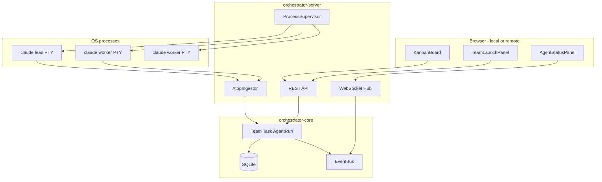
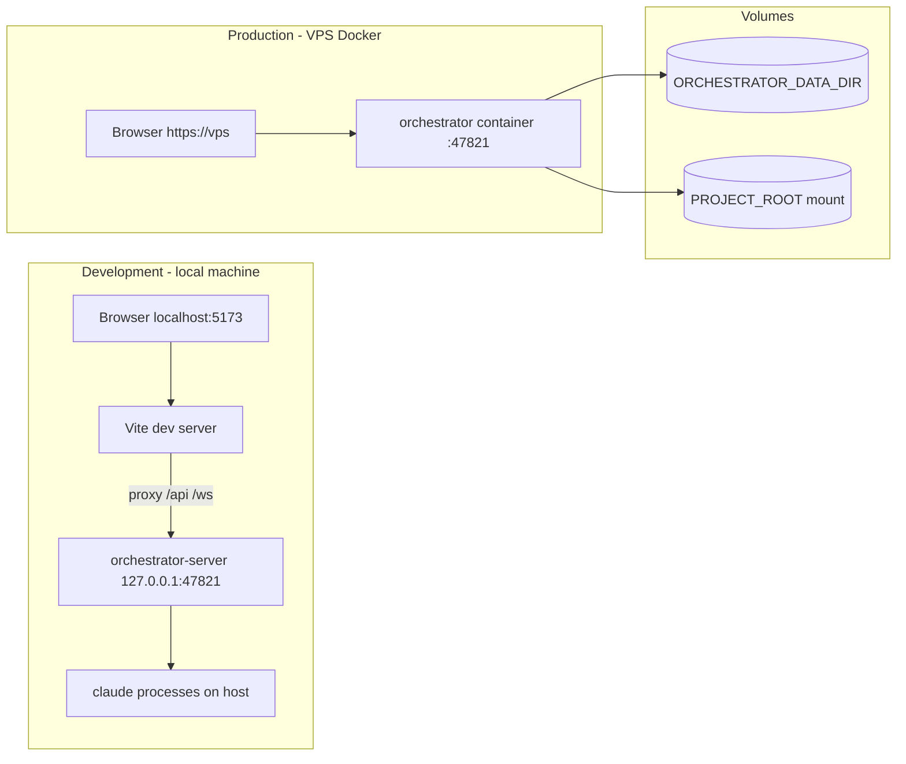

## Summary

Implement V1 of **claude-orchestrator** as a **control plane** (Rust) plus **Svelte web UI**. Operators create teams, launch **Claude Code CLI** teammates, and manage a **real-time kanban** with mixed human/agent task updates.

**Deployment:** **production** = single container on a **VPS** (Docker), UI + API reachable from a remote browser; **development** = same features on **localhost** (Vite + API on loopback, no Docker required for daily work). Agents use a **versioned JSON-lines protocol**, not ad-hoc stdout parsing.

---

## Problem Frame

The repo today sketches YAML workflows and a `ClaudeCodeAgent`, but **does not compile**, workflow execution is stubbed, and there is **no team/task model or UI**. The user's current workaround—**parallel Claude Code via scripts**—needs centralized spawn/stop, shared task state, and a board. (see origin: `docs/brainstorms/2026-05-30-agent-orchestrator-v1-requirements.md`)

---

## Requirements

| ID | Requirement |
|----|-------------|
| R1 | Local project root binding |
| R2 | Team with lead + workers and role prompts |
| R3 | Launch Claude Code children with project `cwd` |
| R4 | Stop/restart teammate or whole team |
| R5 | Durable local persistence |
| R6 | Kanban columns: Backlog, In Progress, Review, Done |
| R7 | Human task CRUD + drag between columns |
| R8 | Agent task actions via machine protocol only |
| R9 | Real-time UI updates (WebSocket) |
| R10 | Agent status + short last-output snippet |
| R11 | Send objective message to lead |
| R12 | Claude Code CLI only |
| R13 | Dev: localhost UI (Vite proxy to API) |
| R14 | Git conflict warning when sharing one checkout |
| R15 | Prod: Docker on VPS, remote browser controls same UI |
| R16 | Prod: SQLite + state on Docker volumes |

Traceability: F1–F5, AE1–AE5, A1–A4 in origin doc.

---

## Key Technical Decisions

| ID | Decision | Rationale |
|----|----------|-----------|
| KTD1 | **Cargo workspace** with `crates/orchestrator-core` (lib) + `crates/orchestrator-server` (binary) + `web/` SPA | Separates testable domain from HTTP/UI; server binary stays thin. |
| KTD2 | **SQLite** via `sqlx` with migrations in `crates/orchestrator-core/migrations/` | Matches local-single-user V1; simple ops; origin R5. |
| KTD3 | **Axum 0.8** HTTP + WebSocket for events | Ecosystem fit with existing `tokio`; **dev** CORS for Vite; **prod** same-origin (UI static + API one process). |
| KTD10 | **Two runtime profiles** via `ORCHESTRATOR_PROFILE=dev\|prod` | **dev:** bind `127.0.0.1`, UI from Vite proxy. **prod:** bind `0.0.0.0`, embed `web/dist` static assets from Axum. |
| KTD11 | **Docker** multi-stage image: build Svelte → build Rust → slim runtime with `claude` CLI expectation documented | VPS deploy is first-class; dev does not require Docker. |
| KTD4 | **Orchestrator DB is source of truth** for kanban—not `~/.claude/tasks` sync | Avoids file-race complexity in V1; native Claude teams integration deferred (origin deferred list). |
| KTD5 | **Long-running teammate sessions** via `tokio::process::Command` with **PTY** (`portable-pty` or `tokio-pty-process`) | One-shot `claude chat --print` is insufficient for ongoing work; aligns with how parallel scripts behave. Exact CLI flags verified at implementation time against installed `claude --help`. |
| KTD6 | **ATOP v1** (Agent Task Orchestration Protocol): newline-delimited JSON on a dedicated **protocol file** under `.orchestrator/` per teammate | Keeps stdout/stderr human-readable; parser is deterministic (origin R8). Example action: `{"op":"task.create","title":"…","status":"backlog"}`. |
| KTD7 | **Svelte 5 + Vite + TypeScript** in `web/` | Lighter bundle/runtime than React; compile-time updates suit kanban + WebSocket; drag via `svelte-dnd-action` (or equivalent). No desktop shell in V1. |
| KTD8 | **Rename/fix** `src/orthestration/` → `orchestration`, repair `main.rs` crate layout | Current tree does not build (`duct` version, `mod lib`, missing `which`, broken executor). |
| KTD9 | **YAML workflow engine** remains **out of V1 critical path**—fix module graph only so crate compiles; wire execution in follow-up | Origin defers workflow-first UX; reduces V1 scope creep. |

---

## High-Level Technical Design



**Session bootstrap (lead/worker):** On launch, supervisor writes `.orchestrator/teams/{team_id}/{member_id}/` containing `protocol.ndjson` (append-only agent→orchestrator), `inbound.md` (orchestrator→agent), and `role.md` (compiled role + provisioning prompt). Initial inject: ATOP capability summary + current board snapshot.

**State machine (agent run):** `starting → running → idle → error → stopped`. Transitions driven by supervisor (process alive), heartbeat (optional V1: stdout activity timestamp), and explicit stop API.

### Deployment profiles



| Env var | Dev default | Prod (Docker) |
|---------|-------------|---------------|
| `ORCHESTRATOR_PROFILE` | `dev` | `prod` |
| `ORCHESTRATOR_BIND_ADDR` | `127.0.0.1` | `0.0.0.0` |
| `ORCHESTRATOR_PORT` | `47821` | `47821` (publish port) |
| `ORCHESTRATOR_DATA_DIR` | `./.data` | `/data` (volume) |
| `ORCHESTRATOR_PROJECT_ROOT` | user-chosen path | `/workspace` (volume) |

**VPS note:** Put **Caddy/nginx + TLS** in front of the container; do not expose plain HTTP to the public internet long-term. **Auth** is deferred in V1 code but mandatory before production exposure (see Risks).

---

## Output Structure

```text
Cargo.toml                    # workspace root
crates/
  orchestrator-core/
    src/
    migrations/
  orchestrator-server/
    src/
web/
  src/
    lib/
    routes/                     # optional: +page.svelte if using SvelteKit; plain App.svelte if Vite-SPA
  package.json
  vite.config.ts
  svelte.config.js
docs/
  brainstorms/
  plans/
examples/
  basic-workflow.yaml         # retained, not V1 UX
docker/
  Dockerfile
  docker-compose.yml          # VPS-oriented example
scripts/
  dev.ps1
  dev.sh
.orchestrator/                # runtime state under project root (gitignored)
```

---

## Scope Boundaries

### Deferred to Follow-Up Work

- Full **YAML workflow** execution (`OrchestrationEngine` completion)
- **Native Claude Code agent teams** file protocol sync (`~/.claude/tasks`, inboxes)
- **Mailbox** between agents, **task blockers**, **code review** UI
- **Multi-provider** agents (`api_client` productionization)
- **Git worktree** isolation per teammate
- **Plugin** dynamic loading (`libloading`) beyond stub
- **API authentication** (Bearer token / login)—document and wire in follow-up before public VPS
- **Built-in TLS** (use reverse proxy)
- Multi-tenant SaaS

### Non-goals (unchanged from origin)

Multi-user SaaS with org billing, built-in editor, replacing Claude CLI.

---

## System-Wide Impact

- **Security (dev):** Default bind `127.0.0.1`; no auth required on loopback.
- **Security (prod):** Bind `0.0.0.0` inside container only; firewall VPS to reverse proxy; **warn on startup** if `prod` and `ORCHESTRATOR_AUTH_TOKEN` unset. Validate project paths (canonicalize, reject `..` escapes).
- **Static UI:** Serve only `web/dist` assets in prod—never expose `.orchestrator` or `ORCHESTRATOR_DATA_DIR` as download paths.
- **Resources:** N teammates = N Claude processes; document recommended max (e.g. 3–4) per VPS size.
- **Git:** R14 warning in UI when `members.len() > 1` and `worktree_mode=false`.
- **Docker:** Image must document how `claude` auth reaches the container (env `ANTHROPIC_API_KEY`, mounted `~/.claude`, or subscription login flow—operator responsibility in V1).

---

## Risks and Dependencies

| Risk | Mitigation |
|------|------------|
| Claude CLI flags differ by version | Feature-detect at startup; integration tests skip if `claude` missing |
| PTY/spawn flaky on Windows | Use `portable-pty`; test matrix includes Windows (user OS) |
| ATOP prompt adherence weak | Lead role prompt requires protocol use; validator rejects malformed lines; human can still move cards (R7) |
| Repo currently non-compiling | U1 is first gate; CI `cargo check` + `cargo test` |
| Parallel agents corrupt git state | R14 warning; document single-checkout limitation |
| VPS UI exposed without auth | Startup warning; README "do not expose until token auth"; follow-up issue |
| Claude CLI unavailable in container | Document base image requirements; health endpoint reports `claude` missing |

**External references:** [Claude Code agent teams docs](https://code.claude.com/docs/en/agent-teams) (future alignment), [agent-teams-ai](https://github.com/777genius/agent-teams-ai) (product reference only).

---

## Implementation Units

### U1. Workspace bootstrap and compile repair

**Goal:** Establish a building workspace and fix broken module graph in the legacy `src/` tree (or migrate into crates).

**Requirements:** Enables all other units.

**Dependencies:** None.

**Files:**
- `Cargo.toml` (workspace)
- `crates/orchestrator-core/Cargo.toml`
- `crates/orchestrator-server/Cargo.toml`
- Migrate/fix from `src/lib.rs`, `src/main.rs`, `src/orchestration/`, `src/agents/`

**Approach:**
- Create workspace; move domain agents/config into `orchestrator-core` or re-export temporarily.
- Fix `duct` pin to compatible version (e.g. `0.13` or `1.x` per crates.io).
- Add missing deps (`which`, `futures`, `serde` on config modules).
- Resolve `orthestration` typo; remove invalid `mod lib` from binary; single `main` delegating to server crate.
- `cargo check` green at end of unit.

**Patterns to follow:** Existing module names under `src/agents/`, `src/config/`.

**Test scenarios:**
- `cargo check --workspace` succeeds.
- `cargo test --workspace` runs (may be empty suite).

**Verification:** Clean compile on developer machine.

---

### U2. Core domain model and SQLite persistence

**Goal:** Persist projects, teams, members, tasks, task events, and agent runs.

**Requirements:** R1, R2, R5, R6 (column enum).

**Dependencies:** U1.

**Files:**
- `crates/orchestrator-core/src/domain/*.rs`
- `crates/orchestrator-core/src/store/mod.rs`
- `crates/orchestrator-core/migrations/001_initial.sql`
- `crates/orchestrator-core/src/error.rs`

**Approach:**
- Entities: `Project`, `Team`, `TeamMember` (role: Lead/Worker), `Task` (status enum matching columns), `TaskEvent` (audit), `AgentRun`.
- Repository trait + `SqliteStore` with sqlx migrate on server start.
- IDs: UUID v4 strings.

**Test scenarios:**
- Insert project + team + two members; query round-trip.
- Create task in `backlog`, transition to `in_progress`, event log records actor `human` vs `agent`.
- Restart store (new connection) — data still present (AE2 persistence slice).

**Verification:** Unit tests in `crates/orchestrator-core/tests/store_test.rs` pass without network.

---

### U3. Process supervisor (Claude Code teammates)

**Goal:** Launch, monitor, stop, and restart Claude Code child processes per team member.

**Requirements:** R3, R4, R10, R12.

**Dependencies:** U2.

**Files:**
- `crates/orchestrator-core/src/supervisor/mod.rs`
- `crates/orchestrator-core/src/supervisor/session.rs`
- Refactor `src/agents/claude_code.rs` → `crates/orchestrator-core/src/agents/claude_code.rs`

**Approach:**
- `Supervisor::spawn(member, project_root, role_prompt)` creates PTY, runs `claude` with verified args (implementation discovers supported non-interactive/long-running flags).
- Stream stdout/stderr to ring buffer (last 2 KB for R10).
- Update `AgentRun` status in DB; emit domain events.
- `stop`/`restart` sends SIGTERM (Unix) / `taskkill` tree (Windows) with grace period.
- On spawn, materialize `.orchestrator/teams/{team_id}/{member_id}/` layout (KTD6).

**Test scenarios:**
- Mock child (shell `echo`) — supervisor transitions `starting → running → stopped`.
- Missing `claude` binary — spawn returns typed error surfaced to API.
- Stop team — all children terminated (AE4 slice).

**Verification:** Integration test with mock binary; manual smoke with real `claude` documented in README.

---

### U4. ATOP ingestor and lead message delivery

**Goal:** Agents mutate tasks only via protocol; operator can message lead.

**Requirements:** R8, R11.

**Dependencies:** U2, U3.

**Files:**
- `crates/orchestrator-core/src/atop/mod.rs`
- `crates/orchestrator-core/src/atop/schema.rs`
- `crates/orchestrator-core/src/atop/ingestor.rs`

**Approach:**
- Define ATOP v1 ops: `task.create`, `task.update_status`, `task.assign`, `ping`.
- Background task tails `protocol.ndjson`; valid lines apply DB mutations with `created_by=agent`.
- Invalid lines → `tracing::warn`, no panic.
- `deliver_lead_message(team_id, text)` appends to lead `inbound.md` and signals supervisor to write to PTY stdin.
- Role prompts include ATOP spec + examples (maintained in `crates/orchestrator-core/resources/atop-v1.md`).

**Test scenarios:**
- Parse line `{"op":"task.create","title":"Fix","status":"backlog"}` → task exists (AE3).
- Malformed JSON line → ignored, store unchanged.
- Lead message write → file contains text; mock PTY receives bytes.

**Verification:** Unit tests for parser + ingest; one integration test with fixture file.

---

### U5. HTTP API and WebSocket event stream

**Goal:** Expose REST for CRUD and WS for realtime board/agent updates.

**Requirements:** R7, R9, R13, R15.

**Dependencies:** U2, U3, U4.

**Files:**
- `crates/orchestrator-server/src/main.rs`
- `crates/orchestrator-server/src/config.rs`
- `crates/orchestrator-server/src/routes/*.rs`
- `crates/orchestrator-server/src/ws/hub.rs`
- `crates/orchestrator-server/src/static.rs` (embed or ServeDir `web/dist` in prod)

**Approach:**
- REST: `POST /projects`, `POST /teams`, `POST /teams/{id}/launch`, `POST /teams/{id}/stop`, `GET/POST/PATCH /teams/{id}/tasks`, `POST /teams/{id}/message`.
- WS: `/ws` subscribe — payloads `TaskUpdated`, `AgentRunUpdated`, `TeamUpdated`.
- **Config (KTD10):** `ORCHESTRATOR_PROFILE`, `ORCHESTRATOR_BIND_ADDR`, `ORCHESTRATOR_PORT`, `ORCHESTRATOR_DATA_DIR`.
- **dev:** bind loopback; permissive CORS for `http://localhost:5173` (Vite).
- **prod:** bind `0.0.0.0`; serve `web/dist` at `/` with SPA fallback; API under `/api` (or same paths as dev—pick one prefix and document); WebSocket `ws://` same host (client uses relative URLs).
- `GET /health` — version, profile, `claude` on PATH yes/no.

**Test scenarios:**
- `POST` task → `GET` returns task; WS client receives `TaskUpdated` within 1s.
- Launch team idempotent guard — double launch returns 409 or no-op per KTD doc.
- Path traversal in project path → 400.

**Verification:** `crates/orchestrator-server/tests/api_test.rs` using `axum::test`.

---

### U6. Web UI — kanban, team launch, agent panel (Svelte)

**Goal:** Web UI for operator journeys F2–F4 (dev locally, prod via VPS URL).

**Requirements:** R6, R7, R9, R10, R11, R13, R14, R15.

**Dependencies:** U5.

**Files:**
- `web/package.json`
- `web/vite.config.ts`
- `web/svelte.config.js`
- `web/src/main.ts`
- `web/src/App.svelte`
- `web/src/lib/components/KanbanBoard.svelte`
- `web/src/lib/components/TeamLauncher.svelte`
- `web/src/lib/components/AgentStatusList.svelte`
- `web/src/lib/api/client.ts` (base URL: `import.meta.env.VITE_API_BASE` empty = relative/same-origin in prod)
- `web/src/lib/stores/orchestrator.ts` (writable stores + WebSocket subscription)

**Approach:**
- Scaffold with `npm create vite@latest web -- --template svelte-ts` (Svelte 5).
- **dev:** Vite proxies `/api` and `/ws` to `127.0.0.1:47821`.
- **prod build:** `VITE_API_BASE=""` so fetch/WS use same origin as embedded static (KTD10).
- Kanban: 4 columns; drag-and-drop via `svelte-dnd-action`; `PATCH` task on drop.
- Reactive state: Svelte 5 runes (`$state`, `$derived`) or classic stores in `orchestrator.ts`; WS events merge into task/agent maps.
- Team launcher form: project path, member list, provisioning prompt, Launch/Stop.
- Agent panel: status chip + truncated last output from API.
- Banner when R14 applies.
- Minimal styling — functional over polish (plain CSS or small utility layer; no heavy UI kit in V1).

**Patterns to follow:** [Svelte 5 docs](https://svelte.dev/docs/svelte/overview); keep components presentational, API/WS in `lib/`.

**Test scenarios:**
- Manual: AE1, AE2, AE5 flows in browser.
- Optional: Playwright smoke `web/e2e/smoke.spec.ts` — create task card visible (if added, keep one happy path).

**Verification:** `pnpm build` (or `npm run build`) succeeds; operator can complete AE1–AE2 without curl.

---

### U7. Packaging — local dev, Docker/VPS, docs

**Goal:** One-command local dev; reproducible **Docker** deploy for VPS; clear operator docs.

**Requirements:** R13, R15, R16, success criteria in origin.

**Dependencies:** U6.

**Files:**
- `README.md`
- `scripts/dev.ps1` / `scripts/dev.sh` (ORCHESTRATOR_PROFILE=dev)
- `docker/Dockerfile` (multi-stage: `pnpm build` web → `cargo build --release` server)
- `docker/docker-compose.yml` (ports, volumes `/data`, `/workspace`, env file template)
- `.env.example`
- `.gitignore` (`.orchestrator/`, `web/node_modules/`, `.data/`)

**Approach:**
- **Local dev:** script starts `orchestrator-server` (dev profile) + `pnpm dev` in `web/`.
- **Docker prod:** image entrypoint runs server with `ORCHESTRATOR_PROFILE=prod`; publish `47821`; mount volumes for R16.
- README sections: *Development (local)*, *Deploy on VPS (Docker)*, *Claude auth in container*, *V1 limitations*, *Security—do not expose without auth*.
- Optional CI job: `docker build` only (no push).

**Test scenarios:**
- Dev: README flow — UI on `localhost:5173`, API on loopback.
- Docker: `docker compose up` — UI loads on `http://localhost:47821` (or mapped port); health returns OK.
- Volume: restart container — tasks still in DB.

**Verification:** Maintainer sign-off AE1–AE2 local + one Docker smoke on Linux (VPS-like).

---

## Open Questions (deferred to implementation)

- Exact `claude` CLI invocation for persistent teammate sessions (discover during U3).
- Whether V1 uses experimental env `CLAUDE_CODE_EXPERIMENTAL_AGENT_TEAMS` or fully custom subprocess model (default: **custom**, native sync deferred).

---

## Sources and Research

- Implementation learning: `docs/solutions/architecture-patterns/claude-orchestrator-v1-stack.md`
- Origin: `docs/brainstorms/2026-05-30-agent-orchestrator-v1-requirements.md`
- Existing code: `src/agents/claude_code.rs`, `src/config/workflow.rs`, `src/cli/commands.rs` (stub)
- External: [Claude Code agent teams](https://code.claude.com/docs/en/agent-teams), reference product [agent-teams-ai](https://github.com/777genius/agent-teams-ai)
