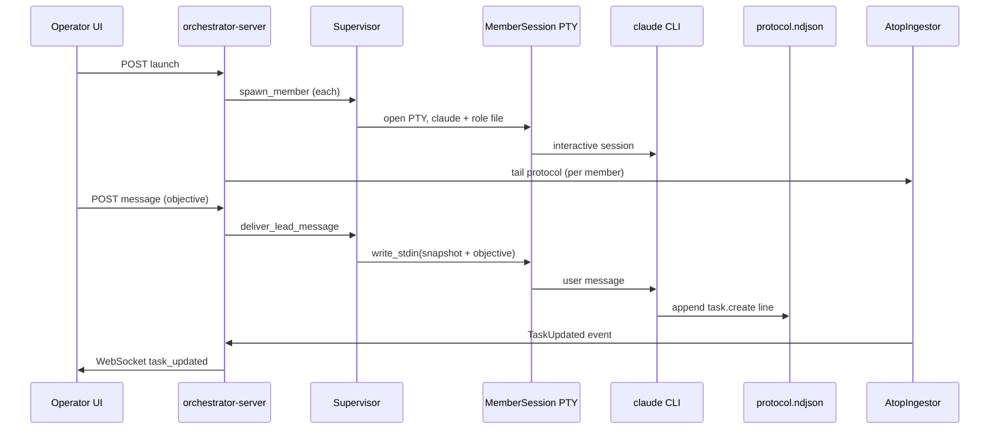

## Summary

V1.1 **hardens V1 on localhost** by replacing the `claude --version` spawn placeholder with **persistent interactive Claude Code sessions** for every team member, delivering **operator objectives to the lead via PTY stdin** (Approach A), and proving the loop when the **lead creates a kanban task via ATOP** after an objective.

Most V1 infrastructure already exists (SQLite, WebSocket, ATOP tail loop, UI launcher/message box). This plan focuses on **supervisor spawn args**, **PTY stdin retention**, **bootstrap prompts**, and **observability**—not new product surfaces.

(see origin: `docs/brainstorms/2026-05-30-agent-orchestrator-v1.1-requirements.md`)

---

## Problem Frame

The repo ships a working control-plane scaffold, but teammates do not run real Claude work sessions, and lead messages only append to a sidecar file without a live PTY writer. Operators cannot satisfy AE3-style proof (lead creates task from objective) or the V1 success criterion (replace parallel scripts).

---

## Requirements Traceability

| Origin | V1.1 requirement | Plan focus |
|--------|------------------|------------|
| R1–R3 | Real persistent sessions for all members | U1, U2 |
| R4–R6 | Objective to lead via live stdin + observable snippet | U2, U3, U5 |
| R7–R9 | ATOP ingest + realtime kanban (existing) | U4, verify U6 |
| R10–R11 | Full team + 5 min lead task proof | U1, U4, U7 |
| R12 | Regression on human kanban, stop, persistence | U7 |
| R14–R16 | Workers need not act; no auth/Docker gate | Out of scope |

Flows: F1–F5 from origin. Acceptance: AE1–AE5.

---

## Key Technical Decisions

| ID | Decision | Rationale |
|----|----------|-----------|
| KTD1 | Spawn `claude` **without** `-p/--print` inside PTY | CLI help: default mode is interactive; `-p` exits after one response (origin R1). |
| KTD2 | Pass role context via **`--append-system-prompt-file`** pointing at `role.md` in member workspace | File already written at spawn; avoids huge argv; matches CLI flags on installed binary. |
| KTD3 | **Retain PTY master writer** in `MemberSession` for `write_stdin` | Origin Approach A; file-only delivery fails R5–R6. |
| KTD4 | After successful PTY write, **also append** to `inbound.md` for audit/restart | Backup trail without making file the sole channel. |
| KTD5 | Embed **absolute paths** to `protocol.ndjson` and ATOP spec in role/bootstrap text | Agent must know where to append JSON lines (tool/Bash); path was missing from `build_role_markdown`. |
| KTD6 | On objective delivery, inject **board snapshot** + delimiter + operator text in one stdin write | Gives lead enough context to emit coherent `task.create`. |
| KTD7 | **Periodic snippet refresh** while sessions live (e.g. every 3–5s) | R6 observability without blocking on agent output events. |
| KTD8 | **Integration tests** stay mock-based; optional `ORCHESTRATOR_CLAUDE_INTEGRATION=1` manual/CI job | Real Claude is flaky in CI; unit tests use mock command (existing pattern). |

**Execution-time discovery (defer to implementation):** Exact non-interactive flags if interactive PTY proves unstable on Windows; minimum Claude Code version after first successful AE3 run.

---

## High-Level Design



---

## Scope Boundaries

### In scope (V1.1)

U1–U7 below; README limitation removal; manual AE1–AE3 checklist.

### Deferred (unchanged / V1.2+)

- Auth/API tokens, mandatory Docker smoke
- Mailbox, blockers, code review UI, multi-provider
- Worker-driven acceptance (origin R14)
- YAML workflow execution
- Native `~/.claude/tasks` sync

---

## Risks

| Risk | Mitigation |
|------|------------|
| Agent does not write `protocol.ndjson` reliably | Lead prompt requires ATOP on every objective; document manual `echo` line for debugging; human can still create tasks (R12 regression) |
| PTY stdin fragile on Windows | Test on user OS; keep `portable-pty`; integration notes in README |
| Multiple `claude` sessions RAM-heavy | Document 2–4 member recommendation (carry from V1 plan) |
| Claude CLI flag drift | Pin documented minimum version; `doctor` subcommand reports version string |

---

## Implementation Units

### U1. Real Claude invocation profile

**Goal:** Replace `claude --version` with a persistent interactive invocation for production spawn path.

**Requirements:** R1, R2, R3, R10.

**Dependencies:** None (builds on existing supervisor).

**Files:**
- `crates/orchestrator-core/src/supervisor/mod.rs`
- `crates/orchestrator-core/src/supervisor/session.rs`
- `crates/orchestrator-core/src/supervisor/workspace.rs`
- `README.md` (limitations section)

**Approach:**
- Add `Supervisor::claude_spawn_args(project_root, role_file)` returning argv: `claude`, `--append-system-prompt-file`, `<role.md>`, `--add-dir`, `<project_root>` (and any verified stable flags from `claude --help`).
- Do **not** pass `-p` / `--print`.
- Extend `build_role_markdown` (or post-write role file) with **Workspace** section: absolute paths to `protocol.ndjson`, `inbound.md`, and condensed ATOP examples + instruction to append one JSON line per action (Bash `>>` or editor tool).
- Keep `mock_command` parameter for tests unchanged.

**Test scenarios:**
- Unit: args builder does not include `--version` or `-p`.
- Existing `supervisor_test.rs` mock spawn still passes.

**Verification:** `cargo test -p orchestrator-core supervisor` green.

---

### U2. PTY stdin writer and lead delivery (Approach A)

**Goal:** `deliver_lead_message` writes into the live lead PTY; inbound file is secondary audit.

**Requirements:** R4, R5, R6.

**Dependencies:** U1.

**Files:**
- `crates/orchestrator-core/src/supervisor/session.rs`
- `crates/orchestrator-core/src/supervisor/mod.rs`
- `crates/orchestrator-server/src/app_state.rs` (no API change expected)

**Approach:**
- Store `Arc<Mutex<Box<dyn Write + Send>>>` (or portable-pty master writer handle) on `MemberSession` created at spawn.
- `write_stdin`: lock writer, write text + newline, flush; on success append same text to `inbound.md`.
- `deliver_lead_message`: unchanged call site; fails fast if lead session missing.

**Test scenarios:**
- Mock process (shell script) that echoes stdin to stdout — deliver message updates `last_output_snippet` within refresh cycle.
- Deliver when session stopped returns error.

**Verification:** New test in `crates/orchestrator-core/tests/supervisor_test.rs` or extend existing.

---

### U3. Session bootstrap and objective envelope

**Goal:** Lead receives enough context at spawn and on each objective to create ATOP tasks.

**Requirements:** R3, R6, R11.

**Dependencies:** U1, U2.

**Files:**
- `crates/orchestrator-core/src/supervisor/mod.rs`
- `crates/orchestrator-server/src/app_state.rs` (`deliver_message`)
- `crates/orchestrator-core/resources/atop-v1.md` (optional one-line “on objective, task.create first” note)

**Approach:**
- After spawn, write initial PTY message: orchestrator ready + “use ATOP at `<protocol path>`” + empty board or task list summary.
- `deliver_message` / supervisor helper: format **objective envelope**:
  - marker line `[orchestrator-objective]`
  - current tasks (id, title, status, assignee) from store
  - operator text
  - reminder: respond by appending `task.create` to protocol file
- Call `deliver_lead_message` with full envelope.

**Test scenarios:**
- Unit test envelope formatter with fixture tasks (string contains objective text and task titles).
- Manual AE2: snippet shows `[orchestrator-objective]` or objective substring within 60s.

**Verification:** Manual step documented in U7.

---

### U4. Lead role prompt and ATOP adherence

**Goal:** Increase probability lead emits valid `task.create` after objective.

**Requirements:** R8, R11.

**Dependencies:** U1, U3.

**Files:**
- `crates/orchestrator-core/src/supervisor/mod.rs` (`build_role_markdown`)
- `crates/orchestrator-core/resources/atop-v1.md`

**Approach:**
- Lead-specific paragraph: when operator sends an objective, **first** append `task.create` with title reflecting the objective; optional follow-up `task.assign` to workers.
- Worker role: may use ATOP but V1.1 does not require it for acceptance.
- Keep ingestor tolerant of malformed lines (existing warn + skip).

**Test scenarios:**
- Snapshot test of lead role markdown contains protocol path placeholder and `task.create` instruction.

**Verification:** Review generated `role.md` under `.orchestrator/` during manual run.

---

### U5. Live snippet refresh loop

**Goal:** UI shows activity after objective delivery (R6).

**Requirements:** R6, R9 (with existing WebSocket).

**Dependencies:** U2.

**Files:**
- `crates/orchestrator-server/src/app_state.rs`
- `crates/orchestrator-server/src/serve/mod.rs` (or spawn site after launch)

**Approach:**
- On successful `launch_team`, spawn tokio task: every 3s call `supervisor.refresh_snippets` for all live member IDs until team stopped (use cancel token or check `has_live_sessions`).
- Cancel refresh task on `stop_team`.

**Test scenarios:**
- Mock session with growing stdout ring buffer — refresh updates `AgentRun.last_output_snippet` in store (unit or integration with in-memory store if available).

**Verification:** Agent panel updates without manual page refresh during manual AE2.

---

### U6. ATOP ingest regression guard

**Goal:** Confirm existing tail loop still drives kanban when protocol file receives lines from real agent.

**Requirements:** R7, R8, R9.

**Dependencies:** U1 (paths in prompt).

**Files:**
- `crates/orchestrator-core/src/atop/ingestor.rs` (only if fixes needed)
- `crates/orchestrator-server/src/app_state.rs`

**Approach:**
- No redesign: `AtopIngestor::run_loop` per member already spawned at launch.
- Manual/debug helper (optional): `POST` dev-only or documented `echo '{"op":"task.create",...}' >> protocol.ndjson` for operator troubleshooting without Claude.
- Ensure ingestor uses correct `team_id` (already passed).

**Test scenarios:**
- Existing `atop_test.rs` remains green.
- Manual AE3: after objective, card appears ≤5 min.

**Verification:** `cargo test -p orchestrator-core atop`.

---

### U7. Documentation, doctor, and manual acceptance

**Goal:** Operators know V1.1 is done and how to run AE1–AE3.

**Requirements:** R12, R13; success criteria.

**Dependencies:** U1–U6.

**Files:**
- `README.md`
- `crates/orchestrator-server/src/cli.rs` (`doctor` — print `claude --version` output)
- `docs/solutions/architecture-patterns/claude-orchestrator-v1-stack.md` (V1.1 delta section)
- `docs/solutions/performance-issues/orchestrator-pty-blocking-tokio-runtime.md` (PTY / Tokio troubleshooting)

**Approach:**
- Remove “placeholder spawn” from limitations; add **V1.1 manual test** section: dev.ps1 → create team → launch → send objective → expect lead task.
- Document `ORCHESTRATOR_CLAUDE_INTEGRATION=1` optional CI/local script if added.
- Note: workers run real sessions but proof is lead-only (origin AE5).

**Test scenarios:**
- Checklist AE1–AE4 on localhost (Windows per user environment).
- AE5: workers idle, lead task still counts.

**Verification:** Maintainer sign-off on checklist.

---

## Sequencing

```text
U1 → U2 → U3 → U4 (prompt can parallel U3)
U2 → U5
U1 → U6 (verify)
U1–U6 → U7
```

Recommended implementation order: **U1, U2, U3, U4, U5, U6, U7**.

---

## Open Questions (execution-time)

- Whether Windows requires extra PTY flags or env (e.g. `TERM`) for `claude` interactive mode.
- If lead consistently ignores file-based ATOP, evaluate `--print` **orchestrator-side** relay (out of V1.1 unless interactive fails)—would be V1.1.1 spike, not default.

---

## Sources

- Origin: `docs/brainstorms/2026-05-30-agent-orchestrator-v1.1-requirements.md`
- Parent: `docs/brainstorms/2026-05-30-agent-orchestrator-v1-requirements.md`
- V1 plan: `docs/plans/2026-05-30-001-feat-agent-orchestrator-v1-plan.md`
- Architecture: `docs/solutions/architecture-patterns/claude-orchestrator-v1-stack.md`
- Troubleshooting (API hang during launch/message): `docs/solutions/performance-issues/orchestrator-pty-blocking-tokio-runtime.md`
- Code: `crates/orchestrator-core/src/supervisor/`, `crates/orchestrator-server/src/app_state.rs`, `web/src/lib/components/TeamLauncher.svelte`
