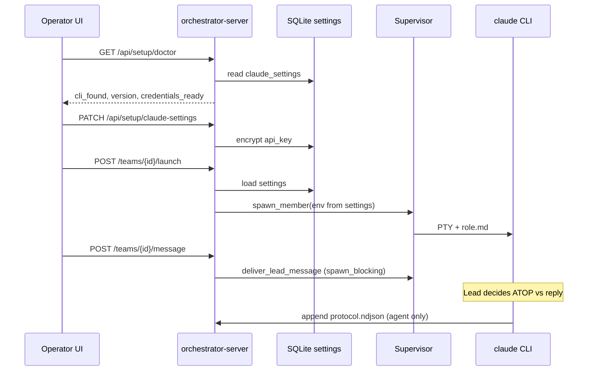

## Summary

V1.2 makes the operator loop **self-contained on localhost**: one `serve` process delivers API and built UI, a **Settings** surface configures Claude Code (CLI login path or API key, including OpenRouter for testing), **doctor** and **guided CLI install** live in-product, and **session health** surfaces dead lead/worker PTYs clearly. The lead remains **autonomous**—objectives are conversational; the orchestrator never writes ATOP on the agent's behalf.

V1.1 PTY spawn, objective delivery, and ATOP ingest stay; this plan adds configuration, packaging, reliability UX, and prompt copy aligned with lead judgment (see origin).

---

## Problem Frame

Operators still run **two processes** locally (API + Vite), configure Claude **outside** the UI, and hit opaque failures (pipe closed, hung busy state) when child `claude` exits. V1.1 docs capture PTY/Tokio fixes but not credential gating, in-app doctor, or lead prompts that over-mandate `task.create`.

V1.2 closes the **operator autonomy** gap while explicitly rejecting deterministic protocol relay (origin R11).

---

## Requirements Traceability

| Origin | V1.2 requirement | Plan focus |
|--------|------------------|------------|
| R1, AE1 | Single local command → API + UI | U1 |
| R2–R4, AE2 | Settings, doctor, guided install | U2, U3, U5 |
| R5–R7, R17 | Persistent spawn, PTY objectives | U4 (env + preflight; carry V1.1) |
| R6 | Fail without CLI or credentials | U3, U4 |
| R8, R10, AE6 | Non-blocking PTY, clean relaunch | U4 (verify + session health) |
| R9 | Session health observable | U4, U5 |
| R11–R13, AE3–AE4 | Lead autonomy, conversational proof | U6, U5 (copy + validation docs) |
| R14–R15 | ATOP ingest, human kanban | Verify U7 regression |
| R16 | V1.1 defect bundle | U4, U5, U7 |
| R18–R22 | Limitations / negatives | Scope + U7 docs |
| F1–F7 | Key flows | U1–U6 |

Acceptance: AE1–AE7 from origin.

---

## Key Technical Decisions

| ID | Decision | Rationale |
|----|----------|-----------|
| KTD1 | **Local unified serve:** when `web/dist/index.html` exists, mount SPA on localhost **in dev profile too** (or introduce `Profile::Local` alias)—default `ORCHESTRATOR_STATIC_DIR` resolves to `web/dist` relative to repo/cwd if unset and dist exists | Meets R1 without requiring Vite for default loop; Docker prod unchanged (origin: Docker = production). |
| KTD2 | **Settings persistence:** new SQLite migration `002_claude_settings.sql` — singleton row (`id = 'default'`) with `credential_mode` (`cli_login` \| `api_key`), optional `api_key_ciphertext`, optional `api_base_url`, `updated_at` | Keeps secrets out of project `.env`; `.data/` already gitignored. |
| KTD3 | **API key at rest:** encrypt with symmetric key stored in `.data/orchestrator.key` (generated on first use); use `chacha20poly1305` via `chacha20poly1305` crate or `aes-gcm`—never log plaintext, never return full key from GET (mask as `sk-…last4`) | Origin outstanding question; avoids OS keychain complexity for V1.2 localhost. |
| KTD4 | **Spawn env injection:** `Supervisor::spawn_member` accepts `LaunchEnv` built from settings—set `ANTHROPIC_API_KEY`, and when base URL set `ANTHROPIC_BASE_URL` / provider-specific vars per first successful OpenRouter test | Third-party keys (OpenRouter) per origin assumption—exact vars verified at implementation (see Open Questions). |
| KTD5 | **Credential readiness:** `doctor` checks PATH + `claude --version` + settings row (api_key mode has ciphertext OR cli_login mode passes auth probe) | R3, R6. Auth probe: lightweight `claude -p` with short timeout in `spawn_blocking`, or read documented credential marker—defer exact probe to U3 implementation notes. |
| KTD6 | **Guided install:** `POST /api/setup/install-claude` runs platform script with explicit confirmation token in body; Windows: `winget install Anthropic.ClaudeCode` or official npm global per README; stream logs to response or poll status | R4; no silent install. |
| KTD7 | **CLI login UX:** Settings "Login with CLI" starts `claude login` subprocess (inherit or pipe stdout); UI shows streaming log; doctor re-run on complete | Origin UX question resolved toward subprocess + browser handoff. |
| KTD8 | **Session health:** during snippet refresh, detect exited child (`try_wait` / writer closed); set `agent_runs.status = failed`, publish `agent_run_updated`, clear stdin writer | R9; prevents false success on `/message`. |
| KTD9 | **Lead prompt autonomy:** replace "first action MUST task.create" with "when the operator asks you to create or track work on the board, use ATOP; otherwise respond in session" | Aligns `bootstrap.rs` with origin R11–R13; remove mandatory footer in `format_objective_envelope`. |
| KTD10 | **No orchestrator ATOP writes** | Already true in ingestor—add explicit test/guard comment in U6; no new relay code. |
| KTD11 | **Orchestrator HTTP auth** | Out of scope (origin R20)—Settings are Claude-only. |

---

## High-Level Technical Design



**Local serve topology**

```text
Operator → http://127.0.0.1:47821/
           ├─ /api/*     REST + doctor/settings
           ├─ /ws        events
           └─ /*         web/dist (when index.html present)
```

---

## Scope Boundaries

### In scope

U1–U7; manual AE1–AE7 on localhost (Windows primary, Linux spot-check).

### Deferred for later (from origin)

- Orchestrator HTTP/API token auth, TLS/VPS hardening product feature
- Mandatory Docker-compose CI gate
- Worker-driven acceptance, mailbox, blockers, code review UI, multi-provider agents, worktrees, YAML engine, native `~/.claude/tasks` sync

### Deferred to Follow-Up Work

- OS keychain integration for API keys (replace file-based master key)
- `ORCHESTRATOR_CLAUDE_INTEGRATION=1` automated CI job against real Claude
- Embedded terminal widget (full xterm.js) if subprocess log streaming proves insufficient

### Outside product identity

Unchanged from V1—orchestrate configured Claude CLI, do not replace Claude Code.

---

## Risks

| Risk | Mitigation |
|------|------------|
| OpenRouter env vars differ by CLI version | Spike in U4; document working combo in README; doctor shows warning if probe fails |
| `claude login` non-interactive in headless server | Subprocess with URL copy to clipboard message; document manual terminal fallback |
| Encrypt-at-rest key file lost → re-enter API key | Acceptable for localhost; document in Settings |
| Serving stale `web/dist` during active UI dev | Document `npm run build -- --watch` or optional Vite proxy env for contributors |
| Lead still ignores ATOP | Softer prompts + AE3 explicit objective; no orchestrator relay (origin) |

---

## Implementation Units

### U1. Single-process localhost (API + UI)

**Goal:** Default local workflow is one `cargo run … serve` opening UI at port 47821 (origin R1, AE1).

**Requirements:** R1, AE1

**Dependencies:** None

**Files:**
- `crates/orchestrator-server/src/config.rs`
- `crates/orchestrator-server/src/routes/mod.rs`
- `crates/orchestrator-server/src/main.rs`
- `scripts/dev.ps1`, `scripts/dev.sh`
- `README.md`

**Approach:**
- Resolve `static_dir`: env `ORCHESTRATOR_STATIC_DIR` OR auto-detect `web/dist` from cwd / workspace root when `index.html` exists.
- Mount `spa_router` when static dir valid **for Dev and Prod** on loopback (keep CORS only when static not mounted—i.e. legacy Vite-only dev via `ORCHESTRATOR_VITE_PROXY=1` optional).
- Update `dev.ps1` / `dev.sh`: `npm run build` once, then single `cargo run … serve` (remove long-running Vite as default).
- README: primary quickstart = build web + one serve command.

**Patterns to follow:** `static_files.rs`, existing Prod mount in `routes/mod.rs`

**Test scenarios:**
- **Happy path:** with temp `web/dist` containing minimal `index.html`, `build_app` serves SPA at `/` and `/api/health` still works.
- **Edge case:** missing `web/dist` — API-only, no panic; warning log.
- **Integration:** `api_test.rs` — GET `/` returns 200 when dist fixture present.

**Verification:** Operator opens `http://127.0.0.1:47821` and sees UI without Vite.

---

### U2. Claude settings persistence

**Goal:** Store credential mode and encrypted API key in SQLite (origin R2).

**Requirements:** R2, R6 (storage half)

**Dependencies:** None

**Files:**
- `crates/orchestrator-core/migrations/002_claude_settings.sql`
- `crates/orchestrator-core/src/store/mod.rs`
- `crates/orchestrator-core/src/store/sqlite.rs`
- `crates/orchestrator-core/src/claude_settings.rs` (new domain + encrypt helpers)
- `crates/orchestrator-core/Cargo.toml` (crypto dep)

**Approach:**
- Table `claude_settings` singleton; fields per KTD2–KTD3.
- `ClaudeSettingsStore` trait: `get`, `upsert`, `mask_api_key_display`.
- Master key file `.data/orchestrator.key` (0o600 on Unix; best-effort on Windows).

**Test scenarios:**
- **Happy path:** upsert api_key mode, get returns mode and masked key.
- **Edge case:** empty api_key with api_key mode → validation error.
- **Error path:** corrupt ciphertext → clear error, no panic.

**Verification:** `cargo test -p orchestrator-core` store tests pass.

---

### U3. Setup API — doctor, settings, install

**Goal:** Expose doctor and settings over REST; guided install endpoint (origin R3–R4, R6).

**Requirements:** R2–R4, R6, AE2

**Dependencies:** U2

**Files:**
- `crates/orchestrator-server/src/routes/setup.rs` (new)
- `crates/orchestrator-server/src/routes/mod.rs`
- `crates/orchestrator-server/src/cli.rs` (align CLI doctor with shared checker)
- `crates/orchestrator-server/tests/api_test.rs`
- `web/src/lib/api/client.ts`

**Approach:**
- `GET /api/setup/doctor` → `{ orchestrator_version, cli: { found, version }, credentials: { mode, ready, hint } }`
- `GET /api/setup/claude-settings` → safe view (no plaintext key)
- `PATCH /api/setup/claude-settings` → mode, optional `api_key`, optional `api_base_url`
- `POST /api/setup/claude-login` → spawn `claude login`, return job id or stream (minimal: blocking OK for V1.2 if simpler)
- `POST /api/setup/install-claude` → requires `{ confirm: true }`; platform-specific command documented in handler
- `launch_team` preflight: call shared `credentials_ready()` → `LaunchError::CredentialsNotConfigured`

**Patterns to follow:** `routes/health.rs`, `LaunchError` in `app_state.rs`

**Test scenarios:**
- **Happy path:** PATCH settings api_key, GET doctor shows `credentials.ready = true` (with mock probe).
- **Error path:** launch without credentials → 400/503 with clear message.
- **Covers AE2:** doctor reflects CLI missing then present after mock install flag (unit-level).

**Verification:** `api_test.rs` covers doctor + settings roundtrip.

---

### U4. Spawn env, launch preflight, session health

**Goal:** Inject credentials into PTY spawn; detect dead children (origin R5–R10, R16, AE3, AE6).

**Requirements:** R5–R10, R16, AE3, AE6

**Dependencies:** U2, U3

**Files:**
- `crates/orchestrator-core/src/supervisor/mod.rs`
- `crates/orchestrator-core/src/supervisor/session.rs`
- `crates/orchestrator-server/src/app_state.rs`
- `crates/orchestrator-core/tests/supervisor_test.rs`

**Approach:**
- `LaunchEnv::from_settings(&ClaudeSettings)` → `HashMap` for `CommandBuilder::env`.
- OpenRouter: set `ANTHROPIC_BASE_URL` + `ANTHROPIC_API_KEY` per spike (document in README).
- `MemberSession::is_alive()` — child not exited, stdin writer open.
- Snippet refresh loop: if !alive, update DB status `failed`, emit event, remove session from map.
- `deliver_lead_message`: map "PTY stdin closed" to 409/503 with `lead_session_not_running` code (not generic 400).
- Verify all PTY paths use `spawn_blocking` (regression for R8).

**Test scenarios:**
- **Happy path:** mock spawn receives env vars when settings api_key mode set.
- **Edge case:** write_stdin after stop → error string contains "closed".
- **Integration:** supervisor_test mock echo still passes with empty LaunchEnv.

**Verification:** Launch + kill lead → message returns session-not-running; health endpoint responds during launch.

---

### U5. Settings UI and operator health panel

**Goal:** In-app Settings and doctor summary (origin R2–R3, F1–F2).

**Requirements:** R2–R3, R9, R16 (UI slice), AE1–AE2

**Dependencies:** U1, U3

**Files:**
- `web/src/lib/components/SettingsPanel.svelte` (new)
- `web/src/App.svelte` (nav: Board | Settings)
- `web/src/lib/api/client.ts`
- `web/src/lib/components/TeamLauncher.svelte` (disable Launch when doctor !ready; link to Settings)

**Approach:**
- Settings form: radio cli_login vs api_key, password input for key, optional base URL, Save, "Run CLI login", "Install Claude CLI" (confirm dialog).
- Doctor card at top of Settings (poll on mount).
- Team launcher: show banner when credentials not ready; fix any remaining single `busy` conflation (R16).

**Test scenarios:**
- **Manual:** AE1 — single URL loads Settings + board.
- **Manual:** AE2 — install button → doctor updates (human QA).

**Verification:** `npm run build` succeeds; Launch disabled until doctor green.

---

### U6. Lead autonomy prompts

**Goal:** Prompts encourage judgment; no mandatory task.create on every objective (origin R11–R13, AE3–AE4).

**Requirements:** R11–R13, AE3–AE4

**Dependencies:** None (can parallel U4)

**Files:**
- `crates/orchestrator-core/src/supervisor/bootstrap.rs`
- `crates/orchestrator-core/resources/atop-v1.md`
- `crates/orchestrator-core/tests/supervisor_test.rs` (assertions on role copy)

**Approach:**
- Rewrite `lead_atop_directive` to conditional language: use ATOP when operator requests board/task actions; otherwise respond normally.
- Change `format_objective_envelope` footer to neutral: "Use ATOP when appropriate to the operator request."
- Update `atop-v1.md` lead section to match.
- Add test: lead role markdown does **not** contain "first action" mandatory phrasing.

**Test scenarios:**
- **Covers AE4 (negative):** role text does not require task.create on every message.
- **Happy path:** objective envelope still includes snapshot + operator text.

**Verification:** `cargo test` bootstrap tests green.

---

### U7. Documentation and acceptance checklist

**Goal:** README, architecture delta, manual AE1–AE7 script (origin success criteria).

**Requirements:** R16–R18, AE1–AE7

**Dependencies:** U1–U6

**Files:**
- `README.md`
- `docs/solutions/architecture-patterns/claude-orchestrator-v1-stack.md`
- `docs/brainstorms/2026-05-30-agent-orchestrator-v1.2-requirements.md` (link from README)
- Optional: `docs/solutions/workflow-patterns/orchestrator-v1.2-local-acceptance.md` if checklist is long

**Approach:**
- Replace two-terminal dev as **primary** with single-serve; keep Vite proxy as advanced contributor note.
- V1.2 manual acceptance: explicit objective string for AE3; note AE4 negative (hello).
- Windows: stop server before rebuild note (from PTY doc).
- Docker section unchanged as production path.

**Test scenarios:**
- **Regression:** `cargo test --workspace`, `cd web && npm run build`.

**Verification:** Maintainer signs AE1–AE7 checklist.

---

## Sequencing

```text
U2 → U3 → U4
U1 (parallel U2)
U5 after U3 + U1
U6 parallel anytime after plan start
U7 last
```

Recommended order: **U2, U1, U3, U4, U6, U5, U7**.

---

## Open Questions (execution-time)

| Question | Owner unit | Notes |
|----------|------------|-------|
| Exact env vars for OpenRouter + installed `claude` | U4 | Run `claude --help` / Anthropic docs; record in README |
| Reliable `credentials_ready` for `cli_login` mode | U3 | May use short `claude -p` probe or existence of `~/.claude/` credential file |
| Whether Dev+CORS+Vite remains as `ORCHESTRATOR_UI=vite` escape hatch | U1 | Prefer single serve; keep Vite optional for hot reload |

---

## Sources

- Origin: `docs/brainstorms/2026-05-30-agent-orchestrator-v1.2-requirements.md`
- V1.1 plan: `docs/plans/2026-05-30-002-feat-agent-orchestrator-v1.1-plan.md`
- Architecture: `docs/solutions/architecture-patterns/claude-orchestrator-v1-stack.md`
- PTY/Tokio: `docs/solutions/performance-issues/orchestrator-pty-blocking-tokio-runtime.md`
- Code: `crates/orchestrator-core/src/supervisor/`, `crates/orchestrator-server/src/app_state.rs`, `web/src/lib/components/TeamLauncher.svelte`
