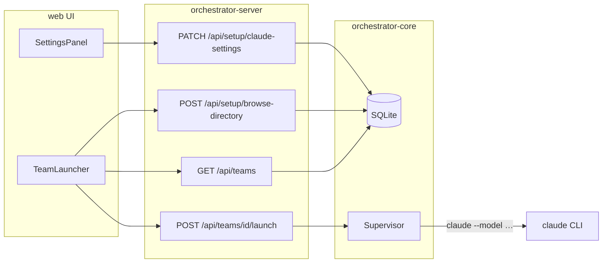

## Summary

**V1.3** improves operator repeatability on localhost: **browse** for a project directory, **pick an existing team** from server history and launch it, and set a **default Claude model** in Settings that applies to every interactive member spawn. No new browser `localStorage` keys; team selection is explicit via the list API.

Builds on V1.2 (SQLite persistence, Settings credentials, PTY supervisor, single-process localhost serve). See origin for R1–R15 and AE1–AE5.

---

## Problem Frame

V1.2 made localhost operation self-contained, but every session still starts from an empty launcher: typed paths, a create-only flow, and CLI-chosen models. Teams and projects already live in SQLite; the UI never lists them. Settings configures credentials only.

This **V1.3** plan closes the repeatability gap without expanding to team editing, templates, or orchestrator HTTP auth (origin out of scope).

---

## Requirements Traceability

| Origin | Requirement | Plan focus |
|--------|-------------|------------|
| R1–R4, AE3, AE5 | Hybrid path + browse + validation | U3, U6 |
| R5–R9, AE1–AE2 | Team list, select, launch/stop, create-new | U2, U6 |
| R10–R12, AE4 | Default model in Settings + PTY spawn | U1, U4, U5 |
| R13–R14 | No new localStorage; reload via server list | U6 |
| R15 | V1.2 regression | U7 |

---

## Key Technical Decisions

| ID | Decision | Rationale |
|----|----------|-----------|
| KTD1 | **`GET /api/teams`** returns enriched rows: `id`, `name`, `project_root_path`, `created_at`, `status` (`running` \| `stopped`) | R5; infer status from latest `agent_runs` per member (any `running`/`starting` → running). JOIN `projects` for path. |
| KTD2 | **`list_teams` on `Store` trait** + SQLite implementation ordered by `teams.created_at DESC` | Single source for UI list and future CLI; no separate “projects list” endpoint unless browse needs it (origin: path comes from team row). |
| KTD3 | **Native browse via `rfd`** on `orchestrator-server`, handler runs dialog in **`tokio::task::spawn_blocking`** | R2; localhost operator tool; avoids browser path limitations. Sync **`POST /api/setup/browse-directory`** returns `{ path }` or **204/400** on cancel/failure (see Open Questions). |
| KTD4 | **Migration `003_claude_default_model.sql`**: `default_model TEXT` nullable on `claude_settings` | Extends singleton row pattern from `002_claude_settings.sql` (see origin KTD2 in V1.2 plan). |
| KTD5 | **`claude_spawn_args(role_file, project_root, model: Option<&str>)`** appends `--model <id>` when set; fallback documented as CLI default when unset | CLI supports `--model` on interactive sessions (`claude --help`); aligns with `claude_code.rs` one-shot path. Product default when unset: document in doctor copy, do not hard-fail launch (R12). |
| KTD6 | **Model UI: curated select + “Custom…”** exposing text input for full model id | Origin deferred question; default assumption from brainstorm. Curated: `sonnet`, `opus`, `haiku` (aliases per CLI) plus empty “use CLI default”. |
| KTD7 | **Remove `resumeTeamIfStored` and `localStorage` team key** | R13; explicit team list replaces auto-resume. On app load: fetch team list only; no pre-selected team until operator clicks. |
| KTD8 | **Launcher modes: `selected` vs `create-new`** | R6/R9: selected team shows read-only path, disabled Browse, Launch/Stop/Message; create-new shows editable path + Browse + full create form. |
| KTD9 | **PTY blocking discipline unchanged** | `docs/solutions/performance-issues/orchestrator-pty-blocking-tokio-runtime.md` — browse dialog and launch stay off async executor. |

---

## High-Level Technical Design



**Operator flows**

```text
Reload app → GET /teams → pick team → loadTeam(id) → Launch
Create new → Browse or type path → fill form → createProject/team/members → Launch

Settings → set default_model → Save → next Launch passes --model to each member
```

---

## Scope Boundaries

### In scope

U1–U7; manual AE1–AE5 on localhost (Windows primary, Linux spot-check per V1.2).

### Deferred for later (from origin)

- Edit, delete, duplicate team; named presets; per-member model; agent-type picker beyond credentials; in-app directory tree; orchestrator HTTP auth; worktrees / multi-provider.

### Deferred to Follow-Up Work

- Server-side `last_selected_team_id` preference row (if product wants auto-highlight without localStorage)
- Headless/CI browse stub (always 503 + manual path) documented in README
- OS keychain for API keys (carry from V1.2)

---

## Implementation Units

### U1. Persist default model in SQLite

**Goal:** Store operator-chosen default model on the singleton `claude_settings` row.

**Requirements:** R10, R11 (persistence layer)

**Dependencies:** None

**Files:**
- `crates/orchestrator-core/migrations/003_claude_default_model.sql` (create)
- `crates/orchestrator-core/src/claude_settings.rs` (modify)
- `crates/orchestrator-core/src/store/sqlite.rs` (modify)
- `crates/orchestrator-core/tests/claude_settings_test.rs` (modify)

**Approach:** Add `default_model: Option<String>` to `ClaudeSettings` and `ClaudeSettingsView`. Extend SELECT/INSERT in sqlite store. Empty string PATCH clears to `None`.

**Patterns to follow:** `002_claude_settings.sql`, existing `upsert_claude_settings` in `sqlite.rs`.

**Test scenarios:**
- Happy path: round-trip `default_model` through store after migration.
- Edge case: `None` when column null / cleared.
- Error path: migration applies on fresh DB and on DB that already ran 001–002.

**Verification:** `cargo test -p orchestrator-core claude_settings` passes; migration runs on server start.

---

### U2. List teams API and store method

**Goal:** Expose persisted teams for the launcher list (R5).

**Requirements:** R5, R6, R14; Covers AE1.

**Dependencies:** None (parallel with U1)

**Files:**
- `crates/orchestrator-core/src/store/mod.rs` (modify)
- `crates/orchestrator-core/src/store/sqlite.rs` (modify)
- `crates/orchestrator-core/src/domain/mod.rs` or new `team_summary.rs` (modify/create — `TeamSummary` DTO)
- `crates/orchestrator-server/src/routes/teams.rs` (modify)
- `crates/orchestrator-core/tests/store_test.rs` (modify)

**Approach:** Add `TeamSummary { id, name, project_root_path, created_at, status }` and `async fn list_teams(&self) -> Result<Vec<TeamSummary>>`. SQL: `teams` JOIN `projects`, left join aggregate on `agent_runs` via `team_members` for running detection. `GET /api/teams` → `Json<Vec<TeamSummary>>`.

**Patterns to follow:** `GET /api/teams/{id}/tasks` list handler in `routes/tasks.rs`; JSON shapes in `api_test.rs`.

**Test scenarios:**
- Happy path: after create project+team, list returns one row with correct `project_root_path`.
- Edge case: empty DB returns `[]`.
- Integration: two teams, only one with `running` agent run → statuses differ.
- Error path: N/A (read-only).

**Verification:** Store test + `GET /api/teams` returns 200 with expected JSON in `api_test.rs` (U7 may consolidate).

---

### U3. Native directory browse endpoint

**Goal:** Hybrid folder picker backend (R2–R3).

**Requirements:** R2, R3; Covers AE3, AE5.

**Dependencies:** None

**Files:**
- `crates/orchestrator-server/Cargo.toml` (modify — add `rfd`)
- `crates/orchestrator-server/src/routes/setup.rs` (modify)
- `crates/orchestrator-server/tests/api_test.rs` (modify — optional mock/skip if headless)

**Approach:** `POST /api/setup/browse-directory` with optional JSON `{ "initial_path": "..." }`. Handler uses `spawn_blocking` + `rfd::FileDialog::new().set_directory(...).pick_folder()`. Response `200 { "path": "..." }`; cancel → `204 No Content` or `400` with `{ "error": "cancelled" }` (pick one, document in handler). Unsupported environment → `503` with message for UI (R3). Reuse `AppState::validate_project_path` before returning path.

**Patterns to follow:** PTY `spawn_blocking` pattern from `supervisor/mod.rs`; setup routes in `routes/setup.rs`.

**Test scenarios:**
- Happy path: unit-test `validate_project_path` only; integration test marked `#[ignore]` for interactive dialog OR test handler error mapping with injected failure.
- Edge case: path containing `..` rejected.
- Error path: 503 when dialog unavailable (document manual path fallback).

**Verification:** Manual: Browse populates path on Windows/macOS/Linux desktop; CI does not require dialog.

---

### U4. Apply model on interactive Claude spawn

**Goal:** Pass configured `--model` to every PTY `claude` child (R11).

**Requirements:** R11, R12; Covers AE4.

**Dependencies:** U1

**Files:**
- `crates/orchestrator-core/src/supervisor/bootstrap.rs` (modify)
- `crates/orchestrator-core/src/supervisor/mod.rs` (modify)
- `crates/orchestrator-server/src/app_state.rs` (modify)
- `crates/orchestrator-core/src/supervisor/bootstrap.rs` `#[cfg(test)]` (modify)

**Approach:** Extend `claude_spawn_args` to append `--model` when `Some`. `launch_team` reads `settings.default_model` and passes to each `spawn_member`. Doctor/settings hint when unset: “CLI default model”.

**Patterns to follow:** `claude_code.rs` `--model` usage; existing `launch_env` block in `app_state.rs`.

**Test scenarios:**
- Happy path: `claude_spawn_args(..., Some("opus"))` vec contains `--model`, `opus`.
- Edge case: `None` → no `--model` args (CLI default).
- Integration: launch with patched settings (U7) — optional process inspection on maintainer machine.

**Verification:** Unit tests in `bootstrap.rs`; manual AE4 checklist.

---

### U5. Settings UI and API for default model

**Goal:** Operator configures model in Settings (R10, R12).

**Requirements:** R10, R12

**Dependencies:** U1

**Files:**
- `crates/orchestrator-server/src/routes/setup.rs` (modify — PATCH body, GET view, doctor hint)
- `web/src/lib/api/client.ts` (modify)
- `web/src/lib/components/SettingsPanel.svelte` (modify)

**Approach:** Extend `PatchClaudeSettings` / `ClaudeSettingsView` with `default_model`. UI: `<select>` with curated options + “Custom” toggles text field. Doctor line: model configured vs CLI default.

**Patterns to follow:** Existing credential_mode / api_key fields in `SettingsPanel.svelte`.

**Test scenarios:**
- Happy path: PATCH model, GET returns value, doctor reflects configured.
- Edge case: clear custom → null in DB.
- Error path: invalid PATCH ignored or 400 (match existing patch style).

**Verification:** `api_test.rs` settings roundtrip extended; manual Settings save.

---

### U6. Team launcher — history, browse, modes

**Goal:** Ship operator-facing UX for list, select, create-new, browse (R1–R9, R13).

**Requirements:** R1–R9, R13–R14; Covers AE1–AE3, AE5.

**Dependencies:** U2, U3, U4 (browse can ship before model if needed, but integrate together)

**Files:**
- `web/src/lib/components/TeamLauncher.svelte` (modify)
- `web/src/lib/api/client.ts` (modify)
- `web/src/lib/stores/orchestrator.ts` (modify — remove localStorage)
- `web/src/App.svelte` (modify — remove `resumeTeamIfStored` onMount)

**Approach:**
- On mount: `api.listTeams()` → render selectable list (name, path, date, status badge).
- Click team → `loadTeam(id)` (no localStorage write per R13; optional: stop writing `TEAM_ID_STORAGE_KEY` entirely).
- **Selected mode:** show read-only path; disable Browse and create fields; show Launch / Stop / message row.
- **Create new mode:** toggle or button; enable path + Browse → `api.browseDirectory()`; existing create+launch flow.
- Browse failure: toast/inline error, manual path still works (R3).
- Keep separate `launchBusy` / `messageBusy` per learnings doc.
- **Settings ↔ Board:** `TeamLauncher` unmounts when `view === 'settings'`; restore `mode` from `teamId` in `onMount` (see ui-bugs solution doc).
- **Kanban:** sync `$tasks` → `columnItems` with `$effect` + `untrack()` to avoid `effect_update_depth_exceeded` when a team is selected.

**Patterns to follow:** `TeamLauncher.svelte` create flow; `loadTeam` in `orchestrator.ts`.

**Test scenarios:**
- Happy path: select existing team → board loads without create form.
- Happy path: create-new + browse fills path → launch creates project+team.
- Edge case: empty team list → prompt to create new.
- Error path: browse 503 shows message; typed path still enables launch.
- Regression: credentials gate still blocks launch when doctor not ready.

**Verification:** Manual AE1–AE3; Playwright optional follow-up (not required in U6).

---

### U7. API integration tests and regression checklist

**Goal:** Lock HTTP contracts and document manual acceptance (R15, AE1–AE5).

**Requirements:** R15; Covers AE1–AE5 (automated where feasible)

**Dependencies:** U1–U6

**Files:**
- `crates/orchestrator-server/tests/api_test.rs` (modify)
- `README.md` (modify — short operator UX section)

**Approach:** Add tests: `list_teams_after_create`, `patch_claude_settings_default_model`, settings GET includes `default_model`. Document manual AE3 (browse), AE4 (process args), AE5 in README maintainer checklist.

**Test scenarios:**
- Covers AE1: GET /teams non-empty after seed.
- Covers AE2: launch still 409/200 per existing rules with credentials mocked or skipped.
- Integration: PATCH model + GET roundtrip.
- Test expectation: none for native dialog automation — manual only.

**Verification:** `cargo test -p orchestrator-server`; manual V1.2 regression smoke (doctor, kanban, stop team).

---

## Risks and Dependencies

| Risk | Mitigation |
|------|------------|
| `rfd` fails on headless Linux CI | 503 + manual path (R3, AE5); `catch_unwind` — see `docs/solutions/ui-bugs/orchestrator-v1.3-svelte-effect-loop-and-launcher-remount.md` |
| `--model` alias drift across CLI versions | Doctor shows CLI `--version`; curated list uses aliases CLI documents |
| Large team list UI clutter | Order by `created_at DESC`; no pagination in v1 (acceptable for localhost) |
| Removing localStorage confuses returning users | Team list visible on every load (R14) |

**Dependencies:** V1.2 complete; `claude` on PATH for AE4 verification.

---

## Open Questions

### Deferred to Implementation

- **Browse cancel HTTP code:** `204` vs `400` — pick one consistent shape for `TeamLauncher` error handling.
- **Running status heuristic:** any member run in `starting`/`running` vs lead-only — default any member (simpler).
- **Create-new reuses project:** if path matches existing `projects.root_path`, reuse project id vs always insert — prefer reuse to avoid duplicate project rows (implementation detail).

---

## Sources and Research

- Origin: `docs/brainstorms/2026-05-30-agent-orchestrator-v1.3-requirements.md`
- `docs/solutions/performance-issues/orchestrator-pty-blocking-tokio-runtime.md`
- `docs/solutions/developer-experience/orchestrator-v1.2-self-contained-localhost.md`
- `docs/solutions/architecture-patterns/claude-orchestrator-v1-stack.md`
- `docs/solutions/ui-bugs/orchestrator-v1.3-svelte-effect-loop-and-launcher-remount.md` (V1.3 browser QA — kanban `$effect`, launcher remount, headless browse)
- Prior plan pattern: `docs/plans/2026-05-30-003-feat-agent-orchestrator-v1.2-plan.md`
- CLI verified locally: `claude --help` exposes `--model <model>` for interactive sessions

---

## Next Steps

-> `/ce-work` to implement U1–U7 in dependency order
